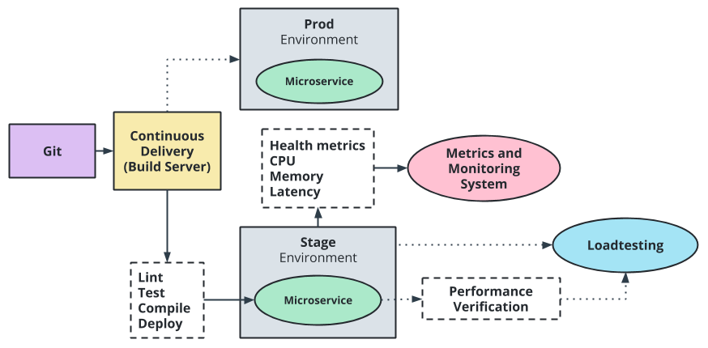
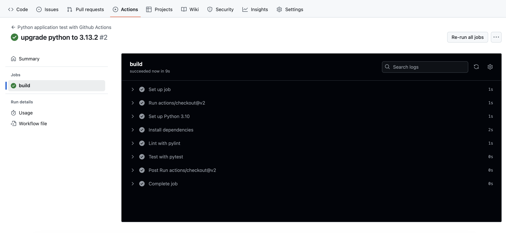
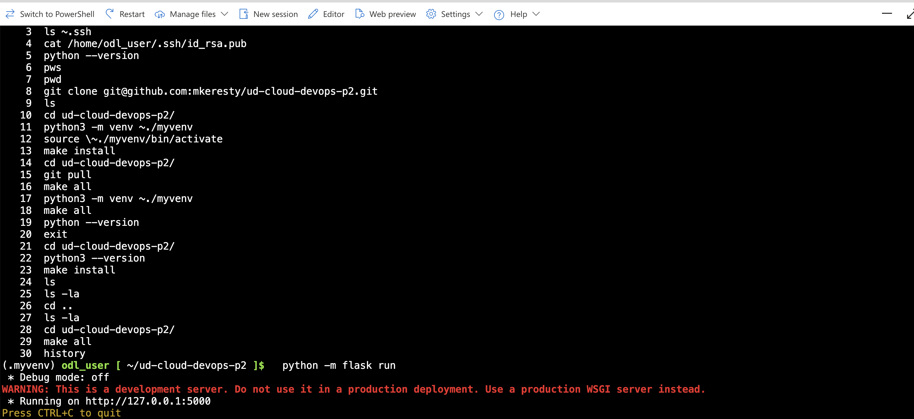
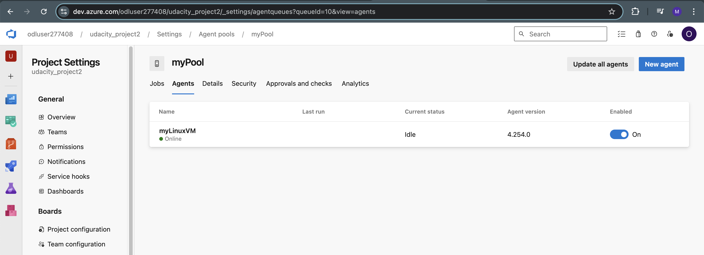
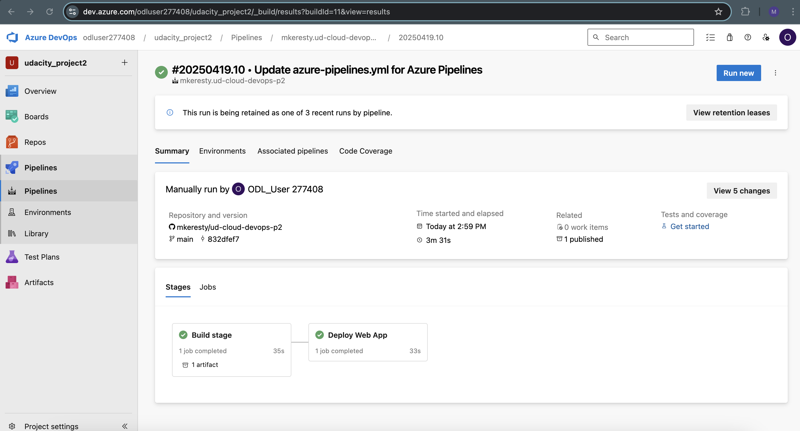
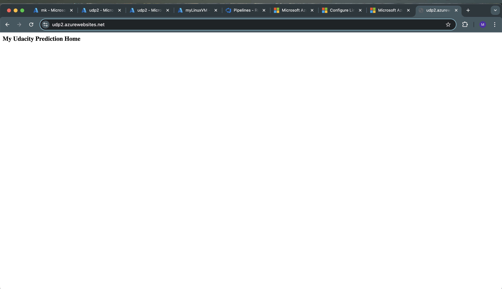
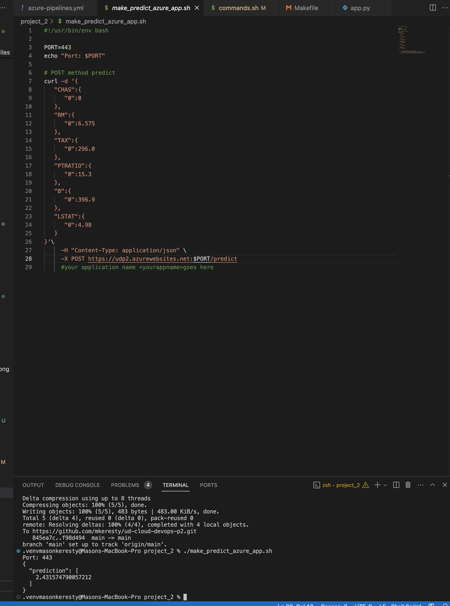
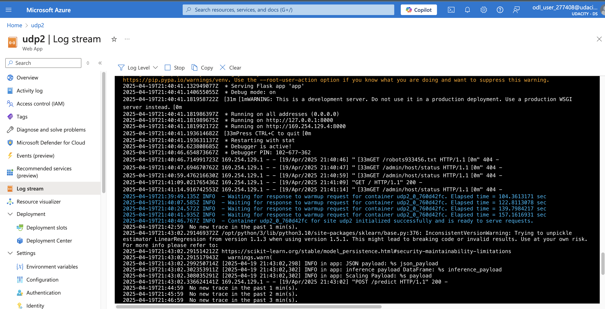

[](https://github.com/mkeresty/ud-cloud-devops-p2/actions/workflows/python-app.yml)

# Overview

This repo contains a flask application that utilizes ML to create house pricing predictions. The supplementary content and instructions outline how to set up Github Actions and Azure Pipelines to create automated setup, testing and deployments to Azure.

## Project Plan
- [Trello Board](https://trello.com/invite/b/68042cccef3166045705d5e6/ATTIf3f09f0b617032288777c2664ce146ea5C172673/my-trello-board)
- [Planning Spreadsheet](./udacity_project_2_spreadsheet.xlsx)

# Architectural Diagram


# CD Diagram


# Azure Web App Deployment Steps

## Variable Configuration
- Modify ```azure-pipelines.yml``` script *variables* section with your variables. (Don't forget to adjust the pool name on lines 24 & 50)
- Modify ```make_predict_azure_app``` line 28 to be your Azure Web App url

## GitHub Setup
1. Upload code to GitHub
2. Go to Github Actions and ensure all tests are passing


3. Go into Azure Cloud Shell and create SSH key
```ssh-keygen -t rsa```
4. Add SSH public key to GitHub

## Azure Cloud Shell Testing
6. Go to the Azure portal and enter the Cloud Shell
5. Copy the repo and test to make sure everything works:
```bash
git clone git@github.com:mkeresty/ud-cloud-devops-p2.git
cd ud-cloud-devops-p2
python3 -m venv ~/.myvenv
source ~/.myvenv/bin/activate
make all
chmod +x make_predict_azure_app.sh
./make_predict_azure_app.sh 
```

If it works you will see something like:
```bash
Port: 443
{"prediction":[20.35373177134412]}
```

## Create Web App
6. Create Web App:
```bash
az webapp up --name udp3 --resource-group Azuredevops --sku B1 --logs --runtime "PYTHON:3.10"
```

## Azure DevOps Setup
7. Go to [dev.azure.com](https://go.microsoft.com/fwlink/?LinkId=307137) and create a new project called `udacity_project2`
8. Click **Create Pipeline** and then **Existing Azure Pipelines YAML file**
9. Go to **Project Settings** then **Service Connections** and **Azure Resource Manager**
10. Click **Service principal (automatic)** and fill in the required fields
11. In **User Settings** create a Personal Access Token and give it full access
12. Create new agent pool in **Project Settings > Agent pools** with type **self-hosted** and check **grant access permissions to all pipelines**

## Setup Agent VM
13. Create VM to be an agent in the pool and install required packages:
```bash
az vm create --resource-group Azuredevops --name myLinuxVM --image Ubuntu2204 --generate-ssh-keys --admin-username azureuser --public-ip-sku Standard
ssh azureuser@<publicIp>
sudo groupadd docker
sudo usermod -aG docker $USER
# go to dev portal then click new agent in the pool settings
curl -O https://vstsagentpackage.azureedge.net/agent/4.254.0/vsts-agent-linux-x64-4.254.0.tar.gz
mkdir myagent && cd myagent
tar -xzvf ../vsts-agent-linux-x64-4.254.0.tar.gz
./config.sh
# enter dev portal url
# enter access token
# enter myPool name
# use default vm myLinuxVM
# use default work folder

sudo ./svc.sh install
sudo ./svc.sh start

sudo apt-get update
sudo apt update
sudo apt install software-properties-common
sudo add-apt-repository ppa:deadsnakes/ppa

sudo apt-get install python3.10-venv
sudo apt-get install python3-pip
sudo apt-get install python3.10-distutils
sudo apt-get -y install zip
pip install pylint==3.2.6
export PATH=$HOME/.local/bin:$PATH
```
You will now see your agent online in the Dev Portal



## Web App Configuration
14. Your web app should now build! Go to the Pipeline page in the Dev portal to see your build status


14. Go back to the Azure portal and to your web app. Then in the configuration fill in start command:
```bash
python3 -m pip install -r requirements.txt && python3 app.py
```

## Using your app
15. Now visit https://udp3-dkbeaqdhhccjd0cz.eastus-01.azurewebsites.net/ and you will see **My Udacity Prediction Home**

16. From test the production Web App
```bash
./make_predict_azure_app.sh
Port: 443
{
  "prediction": [
    2.431574790057212
  ]
}
```

17. You will also be able to view live logs from the Azure Portal



**Note:** Any updates you make will be automaticall deployed!


## Enhancements
- Github CI and Azure Pipelines perform similar actions. Utilize Github more by running tests and building Docker images in Github Actions, then the Azure Pipeline will only be responsible for deploying the containers. This also gives you the added benefit of storing older images if you need to rollback the deployment for any reason.
- Could utilize Kubernetes for deploying high-use web applications where horizontal scaling is required.

## Demo 

- [Watch Demo here](https://youtu.be/RqS0iJqFhWM)
